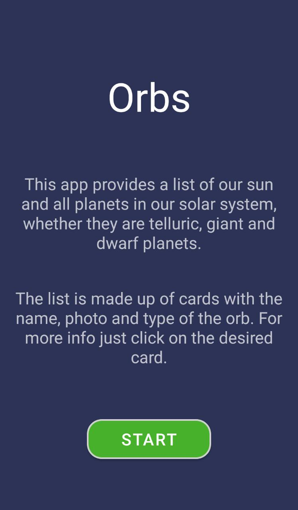
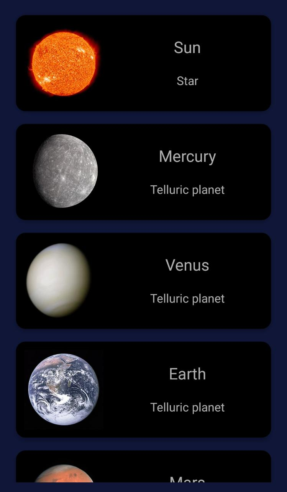
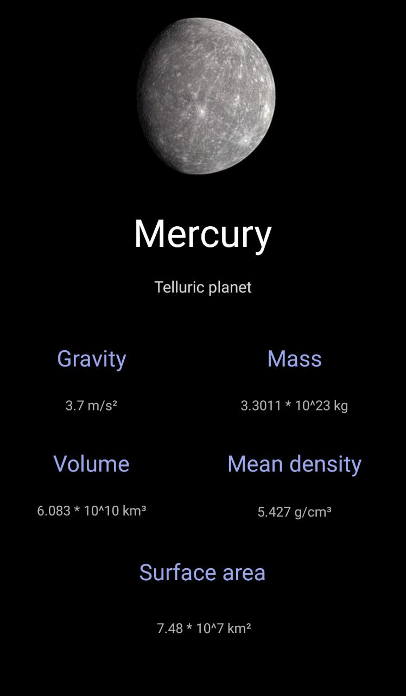

# SolarSystem

This application was developed in Android Studio and uses Kotlin as programming language. In short, it is an app that lists all the planets in our solar system and shows some information about them.

## Images

Below are some screenshots of the app's screens:

### Home screen

### Orbs list

### Example info

